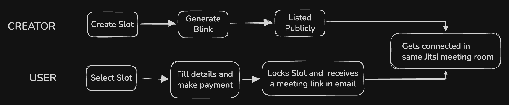

# Interval 

Book time with creators and founders on Solana. Create slots, share blink links, get paid in SOL.



## Quick Start

```bash
bun install
cp .env.example .env
# Edit .env with your values
bun run db:push
bun dev
```

Open [http://localhost:3000](http://localhost:3000).

## Environment Variables

| Variable | Description |
|----------|-------------|
| `DATABASE_URL` | PostgreSQL connection string |
| `NEXT_PUBLIC_APP_URL` | Public app URL (e.g. http://localhost:3000) |
| `SOLANA_NETWORK` | `mainnet-beta` or `devnet` |
| `SOLANA_RPC` | Solana RPC URL |
| `NEXT_PUBLIC_PRIVY_APP_ID` | Privy app ID |
| `PRIVY_APP_SECRET` | Privy app secret |
| `RESEND_FROM` | Sender email for Resend |
| `RESEND_API_KEY` | Resend API key |
| `CLOUDINARY_*` | Cloudinary credentials (cloud name, api key, api secret) |

## Scripts

| Command | Description |
|---------|-------------|
| `bun dev` | Start dev server |
| `bun run build` | Production build |
| `bun run start` | Start production server |
| `bun run db:generate` | Generate Prisma client |
| `bun run db:push` | Push schema to DB |
| `bun run db:migrate` | Run migrations |

## Key Routes

- `/` — Landing
- `/explore` — Browse creators and slots
- `/dashboard` — Creator dashboard
- `/dashboard/onboarding` — Profile setup
- `/booking/[id]?token=...` — Post-booking meeting link
- `/actions.json` — Solana Action manifest

---

Feel free to contribute to this repo and keep building :)
